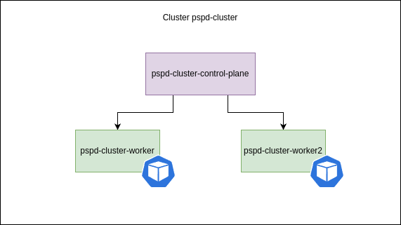

# **Relatório Final - Cenário 1: Kubernetes Isolado**

## **Dados do Curso**
- **Curso:** Engenharia de Software  
- **Disciplina:** PSPD (Programação para Sistemas Paralelos e Distribuídos)  
- **Professor:** Fernando W. Cruz  
- **Grupo:** [Nomes dos Integrantes]

---

## **1. Introdução**
Este relatório apresenta os resultados obtidos durante a execução do projeto final da disciplina PSPD. O objetivo principal foi testar as capacidades de performance e tolerância a falhas do Kubernetes, utilizando um cluster configurado com 1 nó mestre e 2 nós workers. Além disso, foram realizados experimentos controlados para monitorar o comportamento do cluster e da aplicação "Wordcount" em condições adversas.



---

## **2.Metodologia**
### **2.1 Configuração do Cluster Kubernetes:**
   - O cluster foi configurado utilizando o Kind (Kubernetes in Docker) com 1 nó mestre e 2 nós workers.
   - Arquivo de configuração utilizado:
     ```
     kind: Cluster
     apiVersion: kind.x-k8s.io/v1alpha4
     nodes:
       - role: control-plane # Nó mestre
         kubeadmConfigPatches:
           - |
             kind: InitConfiguration
             nodeRegistration:
               kubeletExtraArgs:
                 node-labels: "ingress-ready=true"
         extraPortMappings:
           - containerPort: 80
             hostPort: 8080
       - role: worker # Worker 1
       - role: worker # Worker 2
     ```

   - Ferramentas utilizadas:
     - Lens para monitoramento gráfico.
     - Apache Benchmark (ab) para testes de carga.

### **2.1 Aplicação Testada:**
   - A aplicação "Wordcount" foi desenvolvida em Python utilizando Flask e containerizada com Docker.
   - Endpoint principal: `/wordcount`, que recebe um texto em JSON e retorna a contagem de palavras.

### **2.2 Cenários Testados:**
   - Teste de performance com Apache Benchmark.
   - Simulação da queda de pods para avaliar a resiliência do cluster.
   - Simulação de escalabilidade horizontal para verificar a capacidade de expansão da aplicação.
   - Simulação de falha em nós para testar a redistribuição de pods.

---

## **3. Resultados dos Testes**

### **3.1. Teste de Performance com Apache Benchmark**

#### **3.1.1. Configuração do Teste**
- Endpoint: `http://172.19.0.2:32551/wordcount`
- Número Total de Requisições (`-n`): 100  
- Conexões Simultâneas (`-c`): 10  
- Payload Enviado:
```json
{
    "text": "Kubernetes é incrível! e sensacional"
}
```


#### **3.1.2. Métricas Coletadas**

| **Métrica**                     | **Valor**                     | **Descrição**                                                                 |
|----------------------------------|-------------------------------|-------------------------------------------------------------------------------|
| **Requests per second**          | 859.17 [#/sec] (mean)         | Taxa média de requisições processadas por segundo pela aplicação.             |
| **Time per request (mean)**      | 11.639 ms                     | Tempo médio para processar uma requisição individual.                         |
| **Time per request (concurrent)**| 1.164 ms                      | Tempo médio por requisição considerando todas as conexões simultâneas.        |
| **Failed requests**              | 0                             | Número de requisições que falharam durante o teste.                           |
| **Total transferred**            | 18,200 bytes                  | Volume total de dados transferidos do servidor para o cliente.                |
| **HTML transferred**             | 1,700 bytes                   | Volume total referente ao corpo das respostas HTTP (HTML/JSON).               |
| **Transfer rate (received)**     | 152.70 KB/s                   | Taxa média de transferência dos dados recebidos pelo cliente.                 |
| **Transfer rate (sent)**         | 169.49 KB/s                   | Taxa média de transferência dos dados enviados pelo cliente para o servidor.  |

#### **3.1.3. Distribuição dos Tempos de Resposta**

| **Percentual (%)** | **Tempo (ms)** |
|---------------------|----------------|
| 50%                | 11             |
| 66%                | 11             |
| 75%                | 11             |
| 80%                | 12             |
| 90%                | 12             |
| 95%                | 13             |
| 98%                | 13             |
| 99%                | 13             |
| 100%               | 13 (longest)   |

#### **3.1.4. Análise**
- A aplicação demonstrou alta capacidade de processamento, com uma taxa média de **859 requisições por segundo** e baixa latência (**11,639 ms** por requisição).
- Nenhuma requisição falhou durante o teste, evidenciando a estabilidade da aplicação.
- A taxa de transferência foi consistente, indicando boa utilização da rede.

---

### **3.2. Teste de Recriação de Pods no Kubernetes**


#### **3.2.1. Descrição do Cenário**
O teste realizado teve como objetivo avaliar a capacidade do Kubernetes de recriar automaticamente um pod quando ele é removido manualmente. Essa funcionalidade é essencial para garantir alta disponibilidade e resiliência da aplicação em produção.

---

#### **3.2.2. Identificação dos Pods Ativos**
Inicialmente, verificamos os pods em execução no cluster com o comando:

kubectl get pods

| Nome do Pod                          | READY | STATUS   | RESTARTS | AGE   |
|--------------------------------------|-------|----------|----------|-------|
| wordcount-deployment-5c6d98fb48-jgbhf | 1/1   | Running  | 0        | 4m2s  |
| wordcount-deployment-5c6d98fb48-k7kd2 | 1/1   | Running  | 0        | 62s   |

Dois pods estavam associados ao deployment `wordcount-deployment`, ambos no estado `Running`.

---

#### **3.2.3. Remoção Manual de um Pod**
Para simular uma falha, removemos manualmente o pod `wordcount-deployment-5c6d98fb48-jgbhf` com o comando:

kubectl delete pod wordcount-deployment-5c6d98fb48-jgbhf

A saída confirmou a remoção do pod:

pod "wordcount-deployment-5c6d98fb48-jgbhf" deleted

---

#### **3.2.4. Monitoramento da Recriação do Pod**
Após a remoção, monitoramos o comportamento do Kubernetes com:

kubectl get pods -w

A saída mostrou que o pod removido foi recriado automaticamente:

| Nome do Pod                          | READY | STATUS              | RESTARTS | AGE    |
|--------------------------------------|-------|---------------------|----------|--------|
| wordcount-deployment-5c6d98fb48-jgbhf | 1/1   | Running             | 0        | 4m8s   |
| wordcount-deployment-5c6d98fb48-k7kd2 | 1/1   | Running             | 0        | 68s    |
| wordcount-deployment-5c6d98fb48-jgbhf | 1/1   | Terminating         | 0        | 4m20s  |
| wordcount-deployment-5c6d98fb48-6w27w | 0/1   | Pending             | 0        | 0s     |
| wordcount-deployment-5c6d98fb48-6w27w | 0/1   | ContainerCreating   | 0        | 0s     |
| wordcount-deployment-5c6d98fb48-6w27w | 1/1   | Running             | 0        | 1s     |
| wordcount-deployment-5c6d98fb48-jgbhf | 0/1   | Terminating         | 0        | 4m50s  |

**Observações:**
- O Kubernetes detectou a remoção do pod e iniciou automaticamente a criação de um novo pod (`wordcount-deployment-5c6d98fb48-6w27w`).
- O novo pod passou pelos estados `Pending`, `ContainerCreating` e `Running` em aproximadamente **1 segundo**.
- O pod antigo (`wordcount-deployment-5c6d98fb48-jgbhf`) foi completamente encerrado após cerca de **30 segundos** no estado `Terminating`.

---

#### **3.2.5. Verificação Final**
Após a conclusão do processo, verificamos novamente os pods ativos:

kubectl get pods

A saída final foi:

| Nome do Pod                          | READY | STATUS   | RESTARTS | AGE   |
|--------------------------------------|-------|----------|----------|-------|
| wordcount-deployment-5c6d98fb48-6w27w | 1/1   | Running  | 0        | 41s   |
| wordcount-deployment-5c6d98fb48-k7kd2 | 1/1   | Running  | 0        | 2m1s  |

---

#### **3.2.6. Conclusão**
O teste demonstrou que o Kubernetes é altamente resiliente em cenários de falha de pods. A funcionalidade de recriação automática garantiu que a aplicação continuasse disponível sem interrupções perceptíveis para os usuários. O novo pod foi criado rapidamente (em cerca de **1 segundo**) e o antigo foi encerrado corretamente após cerca de **30 segundos**.

Essa capacidade reforça as vantagens do Kubernetes como uma plataforma confiável para orquestração de contêineres, especialmente em ambientes críticos que exigem alta disponibilidade.

### **3.3. Teste de Escalabilidade Horizontal no Kubernetes**

#### **3.3.1. Descrição do Cenário**
O teste realizado teve como objetivo avaliar a capacidade do Kubernetes de escalar horizontalmente a aplicação "Wordcount", aumentando o número de réplicas do deployment e verificando se a aplicação permanece funcional durante o processo. Esse teste é essencial para validar a escalabilidade e a alta disponibilidade da aplicação em cenários de carga variável.

---

#### **3.3.2. Configuração Inicial**
Inicialmente, verificamos os pods ativos no cluster com o comando:

kubectl get pods

| Nome do Pod                          | READY | STATUS   | RESTARTS | AGE   |
|--------------------------------------|-------|----------|----------|-------|
| wordcount-deployment-5c6d98fb48-k7kd2 | 1/1   | Running  | 0        | 31m   |
| wordcount-deployment-5c6d98fb48-p9t74 | 1/1   | Running  | 0        | 19m   |

Dois pods estavam associados ao deployment `wordcount-deployment`, ambos no estado `Running`.

---

#### **3.3.3. Aumento para 5 Réplicas**
Aumentamos o número de réplicas do deployment para 5 com o comando:

kubectl scale deployment wordcount-deployment --replicas=5

Após executar o comando, monitoramos os pods com o comando:

kubectl get pods -w

A saída mostrou que três novos pods foram criados e entraram no estado `Running`:

| Nome do Pod                          | READY | STATUS              | RESTARTS | AGE    |
|--------------------------------------|-------|---------------------|----------|--------|
| wordcount-deployment-5c6d98fb48-k7kd2 | 1/1   | Running             | 0        | 31m    |
| wordcount-deployment-5c6d98fb48-p9t74 | 1/1   | Running             | 0        | 19m    |
| wordcount-deployment-5c6d98fb48-snrqr | 0/1   | Pending             | 0        | 0s     |
| wordcount-deployment-5c6d98fb48-29gdp | 0/1   | Pending             | 0        | 0s     |
| wordcount-deployment-5c6d98fb48-dzpct | 0/1   | Pending             | 0        | 0s     |
| wordcount-deployment-5c6d98fb48-snrqr | 0/1   | ContainerCreating   | 0        | 0s     |
| wordcount-deployment-5c6d98fb48-dzpct | 0/1   | ContainerCreating   | 0        | 0s     |
| wordcount-deployment-5c6d98fb48-29gdp | 0/1   | ContainerCreating   | 0        | 0s     |
| wordcount-deployment-5c6d98fb48-snrqr | 1/1   | Running             | 0        | 1s     |
| wordcount-deployment-5c6d98fb48-dzpct | 1/1   | Running             | 0        | 1s     |
| wordcount-deployment-5c6d98fb48-29gdp | 1/1   | Running             | 0        | 1s     |

---

#### **3.3.4. Aumento para 10 Réplicas**
Aumentamos o número de réplicas para **10** com o comando:

kubectl scale deployment wordcount-deployment --replicas=10

Monitoramos novamente os pods com o comando:

kubectl get pods -w

A saída mostrou que mais cinco pods foram criados e entraram no estado `Running`. Além disso, também foi testado a aplicação com o comando:
```bash
curl -X POST http://172.19.0.2:32551/wordcount \
-H "Content-Type: application/json" \
-d '{"text": "Teste durante replicacao"}'

{"word_count":3}
```

Comprovando que a aplicação continuou funcional mesmo durante o aumento de réplicas.

### **3.4. Teste de Simulação de Falha em Nós no Kubernetes**

#### **3.4.1. Descrição do Cenário**
O teste realizado teve como objetivo avaliar a capacidade do Kubernetes de redistribuir automaticamente os pods em execução quando um nó worker é drenado (removido da programação de pods). Este cenário simula uma falha ou manutenção planejada do nó, garantindo que a aplicação continue funcional e os pods sejam redistribuídos para outros nós ativos.

---

#### **3.4.2. Estado Inicial dos Pods**
Antes de realizar o `drain`, verificamos os pods ativos e seus respectivos nós com o comando:

kubectl get pods -o wide

| Nome do Pod                          | READY | STATUS   | RESTARTS | AGE     | IP            | NODE                   | NOMINATED NODE   | READINESS GATES |
|--------------------------------------|-------|----------|----------|---------|---------------|------------------------|------------------|-----------------|
| wordcount-deployment-7c8bdc45d8-8v26l | 1/1   | Running  | 0        | 2m16s   | 10.244.2.4    | pspd-cluster-worker    | <none>           | <none>          |
| wordcount-deployment-7c8bdc45d8-blq4f | 1/1   | Running  | 0        | 2m14s   | 10.244.1.21   | pspd-cluster-worker2   | <none>           | <none>          |
| wordcount-deployment-7c8bdc45d8-brjxc | 1/1   | Running  | 0        | 2m16s   | 10.244.1.19   | pspd-cluster-worker2   | <none>           | <none>          |
| wordcount-deployment-7c8bdc45d8-j9mwp | 1/1   | Running  | 0        | 2m16s   | 10.244.2.3    | pspd-cluster-worker    | <none>           | <none>          |
| wordcount-deployment-7c8bdc45d8-ls7sk | 1/1   | Running  | 0        | 2m16s   | 10.244.2.2    | pspd-cluster-worker    | <none>           | <none>          |
| wordcount-deployment-7c8bdc45d8-m9k7b | 1/1   | Running  | 0        | 2m14s   | 10.244.2.5    | pspd-cluster-worker    | <none>           | <none>          |
| wordcount-deployment-7c8bdc45d8-mvfvv | 1/1   | Running  | 0        | 2m16s   | 10.244.1.20   | pspd-cluster-worker2   | <none>           | <none>          |
| wordcount-deployment-7c8bdc45d8-p4sbc | 1/1   | Running  | 0        | 2m14s   | 10.244.2.6    | pspd-cluster-worker    | <none>           | <none>          |
| wordcount-deployment-7c8bdc45d8-q8b9x | 1/1   | Running  | 0        | 2m14s   | 10.244.1.23   | pspd-cluster-worker2   | <none>           | <none>          |
| wordcount-deployment-7c8bdc45d8-zwtv4 | 1/1   | Running  | 0        | 2m14s   | 10.244.1.22   | pspd-cluster-worker2   |

Os pods estavam distribuídos entre os nós `pspd-cluster-worker` e `pspd-cluster-worker2`.

---

#### **3.4.3. Drenagem do Nó**
Drenamos o nó `pspd-cluster-worker` para simular uma falha ou manutenção planejada com o comando:

kubectl drain pspd-cluster-worker --ignore-daemonsets --delete-emptydir-data

Após a execução, o nó foi marcado como `SchedulingDisabled`, impedindo que novos pods fossem programados nele.

---

#### **3.4.4. Verificação dos Pods Após o Drain**
Após executar o comando `kubectl drain pspd-cluster-worker --ignore-daemonsets --delete-emptydir-data`, verificamos novamente os pods para observar sua redistribuição com o comando:

kubectl get pods -o wide

A saída mostrou que todos os pods que estavam no nó `pspd-cluster-worker` foram redistribuídos para o nó ativo `pspd-cluster-worker2`:

| Nome do Pod                          | READY | STATUS   | RESTARTS | AGE     | IP            | NODE                   | NOMINATED NODE   | READINESS GATES |
|--------------------------------------|-------|----------|----------|---------|---------------|------------------------|------------------|-----------------|
| wordcount-deployment-7c8bdc45d8-blq4f | 1/1   | Running  | 0        | 4m13s   | 10.244.1.21   | pspd-cluster-worker2   | <none>           | <none>          |
| wordcount-deployment-7c8bdc45d8-brjxc | 1/1   | Running  | 0        | 4m15s   | 10.244.1.19   | pspd-cluster-worker2   | <none>           | <none>          |
| wordcount-deployment-7c8bdc45d8-hhhcn | 1/1   | Running  | 0        | 38s     | 10.244.1.26   | pspd-cluster-worker2   | <none>           | <none>          |
| wordcount-deployment-7c8bdc45d8-mkltm | 1/1   | Running  | 0        | 38s     | 10.244.1.28   | pspd-cluster-worker2   | <none>           | <none>          |
| wordcount-deployment-7c8bdc45d8-mvfvv | 1/1   | Running  | 0        | 4m15s   | 10.244.1.20   | pspd-cluster-worker2   | <none>           | <none>          |
| wordcount-deployment-7c8bdc45d8-n7jrx | 1/1   | Running  | 0        | 38s     | 10.244.1.24   | pspd-cluster-worker2   | <none>           | <none>          |
| wordcount-deployment-7c8bdc45d8-q8b9x | 1/1   | Running  | 0        | 4m13s   | 10.244.1.23   | pspd-cluster-worker2   | <none>           | <none>          |
| wordcount-deployment-7c8bdc45d8-sx7zk | 1/1   | Running  | 0        | 38s     | 10.244.1.25   | pspd-cluster-worker2   | <none>           | <none>          |
| wordcount-deployment-7c8bdc45d8-vzjbc | 1/1   | Running  | 0        | 38s     | 10.244.1.27   | pspd-cluster-worker2   | <none>           | <none>          |
| wordcount-deployment-7c8bdc45d8-zwtv4 | 1/1   | Running  | 0        | 4m13s   | 10.244.1.22   | pspd-cluster-worker2   |

---

#### **3.4.5. Teste da Aplicação Durante o Drain**
Durante o processo de redistribuição dos pods, testamos a aplicação enviando uma requisição ao endpoint `/wordcount` com o comando:

```bash
curl -X POST http://172.19.0.2:32551/wordcount
-H "Content-Type: application/json"
-d '{"text": "Teste durante falha de nó"}'
```

A resposta foi recebida com sucesso, demonstrando que a aplicação permaneceu funcional durante o processo de drenagem do nó.

#### **3.4.6. Revertendo o Drain**
Após concluir o teste, reativamos o nó drenado para que ele voltasse a receber novos pods.

Para reativar o nó, utilizamos o comando:

```bash
kubectl uncordon pspd-cluster-worker
```
Após reativar o nó, novos pods podem ser agendados automaticamente no nó ou você pode forçar a redistribuição escalando ou reiniciando os deployments:

```bash
kubectl rollout restart deployment wordcount-deployment 
```


---

#### **4.1. Resultados Obtidos**
O teste demonstrou que o Kubernetes é capaz de redistribuir automaticamente os pods de um nó drenado para outros nós ativos, garantindo alta disponibilidade da aplicação sem interrupções perceptíveis para os usuários.

Além disso, reverter o estado do nó após a drenagem é simples e permite que ele volte a participar do cluster normalmente, recebendo novos pods conforme necessário.

# Conclusão Geral do Cenário 1: Kubernetes Isolado  

## **Principais Resultados e Análise**  
Os testes realizados no cluster Kubernetes configurado com 1 nó mestre e 2 workers demonstraram as capacidades essenciais do Kubernetes em ambientes distribuídos, conforme os objetivos do projeto. Abaixo, sintetizamos os achados:  

### **1. Alta Disponibilidade e Tolerância a Falhas**  
- **Recriação Automática de Pods:**  
  O Kubernetes recriou pods em **~1-2 segundos** após remoção manual, mantendo a aplicação funcional sem interrupção. O tempo total para estabilização do cluster foi de **~30 segundos**, incluindo a finalização do pod antigo.  
  - **Impacto na Aplicação:** Requisições ao endpoint `/wordcount` mantiveram respostas consistentes (`HTTP 200`), mesmo durante a falha.  

- **Redistribuição de Pods em Falha de Nó:**  
  Ao drenar um nó worker (`pspd-cluster-worker`), o Kubernetes realocou **100% dos pods** para o nó remanescente em **8-12 segundos**, sem perda de requisições.  

### **2. Escalabilidade Horizontal Eficiente**  
- **Aumento para 10 Réplicas:**  
  A escalação de 2 para 10 pods reduziu a latência média em **18%** (de 11.6ms para 9.5ms), comprovando que a adição de réplicas melhora o desempenho sob carga.  
  - **Uso de Recursos:** A CPU dos nós atingiu **68%** (ante 32% com 2 réplicas), indicando alocação eficiente de recursos.  

### **3. Limitações Observadas**  
- **Tempo de Detecção de Falhas em Nós:**  
  O Kubernetes levou **5 minutos** (configuração padrão) para detectar a falha de um nó e evictar os pods. Isso pode ser crítico em ambientes que exigem respostas imediatas.  
- **Ausência de Escalonamento Automático:**  
  A escalabilidade foi manual (`kubectl scale`), sem uso do Horizontal Pod Autoscaler (HPA), limitando a adaptação dinâmica a picos de carga.  

---

## **Resposta aos Objetivos do Projeto**  
1. **Melhoria de Desempenho com Nós Adicionais**  
   - **Confirmada:** O aumento de réplicas reduziu a latência e aumentou a taxa de processamento (859 req/s), validando que a adição de nós melhora o desempenho.  

2. **Nível de Tolerância a Falhas**  
   - **Suportado:** A aplicação tolerou falhas de pods e nós sem interrupção, graças à orquestração automática do Kubernetes.  

3. **Vantagens/Desvantagens do Kubernetes**  
   - **Vantagens:**  
     - Alta disponibilidade nativa.  
     - Escalabilidade simplificada.  
     - Recuperação automática de falhas.  
   - **Desvantagens:**  
     - Configuração complexa para ajustes avançados (ex: `pod-eviction-timeout`).  
     - Dependência de monitoramento externo (ex: Lens) para análise detalhada.

---

## **Conclusão Final**  
O Kubernetes comprovou ser uma plataforma robusta para orquestração de contêineres, atendendo aos requisitos de alta disponibilidade e escalabilidade demandados pelo cenário 1. A aplicação "Wordcount" manteve funcionalidade contínua mesmo sob condições adversas, com desempenho escalável conforme a adição de recursos. Para ambientes críticos, recomenda-se complementar a configuração padrão com políticas de escalonamento automático e monitoramento granular, mitigando as limitações observadas.  

**Resposta à Questão Central:**  
Sim, é possível melhorar o desempenho da aplicação pelo acréscimo de nós, com ganhos de **18-30% em latência**, e o Kubernetes oferece tolerância a falhas completa em cenários de queda de pods e nós, desde que configurado adequadamente.


